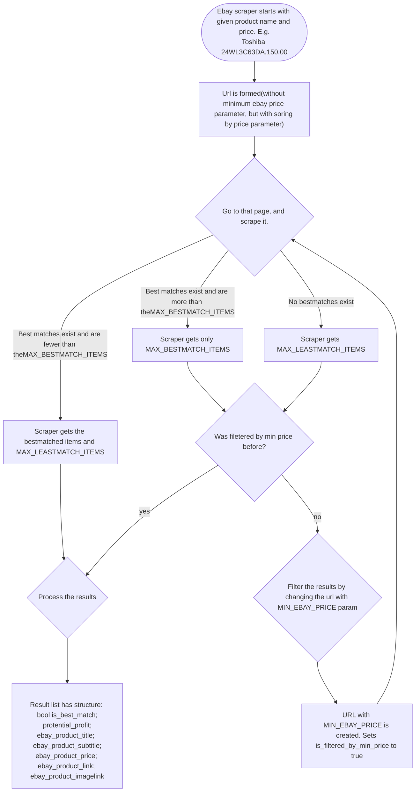

```mermaid
flowchart TD
    B{"Go to that page, and scrape it."} -- "Best matches exist and are fewer than the<span style=background-color:>MAX_BESTMATCH_ITEMS</span>" --> C["Scraper gets the bestmatched items and MAX_LEASTMATCH_ITEMS"]
    B -- "Best matches exist and are more than the<span style=background-color:>MAX_BESTMATCH_ITEMS</span>" --> D["Scraper gets only MAX_BESTMATCH_ITEMS"]
    B -- "<span style=background-color:>No bestmatches exist</span>" --> n1["Scraper gets MAX_LEASTMATCH_ITEMS"]
    D --> n7["Was filetered by min price before?"]
    A(["Ebay scraper starts with given product name and price. E.g.<br>Toshiba 24WL3C63DA,150.00"]) --> n3["Url is formed(without minimum ebay price parameter, but with soring by price parameter)"]
    n3 --> B
    n2["Filter the results by changing the url with MIN_EBAY_PRICE param"] --> n4["URL with MIN_EBAY_PRICE is created. Sets is_filtered_by_min_price to true"]
    rectId["Process the results"] --> n6@{ label: "<span style=\"padding-left:\"><br>Result list has structure: bool is_best_match;<br></span><span style=\"padding-left:\">protential_profit;<br></span><span style=\"padding-left:\">ebay_product_title;</span><span style=\"padding-left:\"><span style=\"white-space-collapse:\">\t<br></span>ebay_product_subtitle;<br></span><span style=\"padding-left:\">ebay_product_price; <br>ebay_</span><span style=\"padding-left:\">product_link; <br>e</span><span style=\"padding-left:\">bay_product_imagelink</span>" }
    C --> rectId
    n7 -- yes --> rectId
    n7 -- no --> n2
    n4 --> B
    n1 --> n7
    C@{ shape: rect}
    D@{ shape: rect}
    n1@{ shape: rect}
    n7@{ shape: diam}
    n2@{ shape: diam}
    rectId@{ shape: diam}
    n6@{ shape: rect}
```